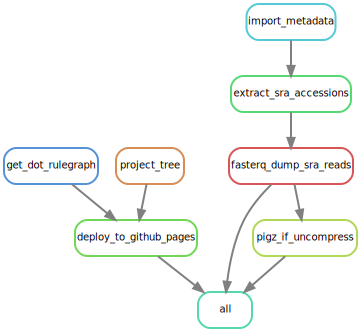

# (PART) IMAP FRAMEWORK {-}

# Introduction to IMAP Framework {-}

URL: https://github.com/datainsights/imap-project-overview/

Welcome to the IMAP ("Integrated Microbiome Analysis Pipelines") framework—a meticulously crafted structure empowering researchers, scientists, developers, and enthusiasts in conducting thorough analyses of intricate microbiome data. Each chapter within IMAP stands as an independent GitHub repository (repo), offering a dedicated space for focused exploration and understanding.

## Primary objectives
Our primary objectives revolve around reproducibility, clarity, and efficiency. We understand the challenges inherent in microbiome data analysis and aim to equip you with the tools and strategies necessary to navigate this complex landscape with confidence.

## Unified Environments for Streamlined Analysis

Microbiome data analysis encompasses a diverse set of tools and platforms, from R and Python for statistical analysis to Snakemake for workflow management, and GitHub Actions for continuous integration and deployment. To streamline this process and ensure reproducibility, we adopt a strategy of managing these tools within unified environments.

- **RStudio for R Analysis:** Discover how we leverage RStudio for developing and documenting R scripts or notebooks. All required R packages are installed and managed within the R environment, providing a controlled and reproducible setup.

- **Jupyter Notebook for Python Analysis:** Dive into the use of Jupyter Notebooks for Python-based analysis. Python packages are isolated within the Jupyter environment, ensuring a clean and consistent setup.

- **Conda Environment for Snakemake Workflows:** Explore the versatility of Snakemake workflows, managed within a dedicated Conda environment. This approach guarantees that dependencies for each workflow are isolated and reproducible.

- **GitHub Actions for Continuous Integration and Deployment:** Learn how we utilize GitHub Actions to automate continuous integration and deployment processes. This ensures the consistent and automated testing, building, and deployment of our microbiome data analysis workflows, contributing to a more efficient and reliable development pipeline.

## Unifying the Analysis Outputs

Outputs from RStudio, Jupyter Notebook, and Snakemake workflows converge in a final HTML report, serving as the culmination of our analytical efforts.

- **Comprehensive Insights:** The final HTML report offers a holistic view of the microbiome analysis, incorporating both the code and results from various components.

- **Efficient Collaboration:** Discover how consolidating outputs enhances collaboration, enabling team members to easily reproduce and build upon the analysis.


## Considerations for Incompatibility

While advocating for a unified environment, we acknowledge that certain packages may be incompatible with others. We offer guidance on handling such scenarios, ensuring that potential conflicts are addressed with minimal disruption to the analysis process.


# (PART) IMAP-PART 01 {-}
# IMAP Toolkit: Essential Requirements {#imap-part01}


In this chapter, we embark on the practical journey of equipping you with the essential tools needed for efficient and reproducible microbiome data analysis. From installing fundamental software in R and Python to configuring workflow systems, Conda environments, and GitHub/GitHub Actions, this chapter provides a step-by-step demonstration. By the end of this guide, you'll have a well-configured toolkit ready for hands-on exploration and analysis in the fascinating realm of microbiome data. A more detailed description is described in [IMAP-PART 01](https://tmbuza.github.io/imap-software-requirements/)


# (PART) IMAP-PART 02 {-} 
# Microbiome sample metadata {#imap-part02}


Microbiome sample metadata offers valuable contextual and background information about the samples, playing a crucial role in comprehending the factors that can impact microbial composition and function. Creating a well-organized metadata table is essential to:

- Enhance the reliability, comparability, and transparency of microbiome research.
- Facilitate the integration of data, promote reproducibility, and foster collaboration, ultimately leading to stronger and more significant scientific findings in the field of microbiome analysis.

 A more detailed description is described in [IMAP-PART 02](https://tmbuza.github.io/imap-sample-metadata/)


# (PART) IMAP-PART 03 {-} 
# Downloading Reads from SRA {#imap-part03}



The SRA database serves as a valuable resource for obtaining demo or training data for microbiome data analysis. It provides access to diverse, real-world datasets that can aid in the development and evaluation of robust and effective methods for studying microbial communities using 16S rRNA gene or the shotgun metagenomic sequencing.  

A more detailed description is described in [IMAP-PART 03](https://tmbuza.github.io/imap-download-sra-reads/)


# (PART) IMAP-PART 04 {-} 
# Quality Control of Fastq Reads {#imap-part04}


Quality control of Fastq reads is a crucial step in analyzing sequencing data, especially in next-generation sequencing (NGS) projects. Briefly:

- Fastq files contain the raw sequencing reads along with quality scores for each base.
- By performing comprehensive quality control of Fastq reads, researchers can ensure the reliability and accuracy of subsequent analyses, leading to more robust and meaningful results.

A more detailed description is described in [IMAP-PART 04](https://tmbuza.github.io/imap-read-quality-control/)


# (PART) IMAP-PART 05 {-} 
# Microbial profiling using Mothur {#imap-part05}


```{block, type="infoicon", echo=TRUE}
Mothur is a software package designed for the analysis of microbial community data obtained from DNA sequencing. Briefly:

- The workflow involves preprocessing raw sequencing data by removing low-quality reads and contaminants.
- Mothur aligns the high-quality reads to a reference database, such as [SILVA alignments](https://www.arb-silva.de/), to assign taxonomic information.
- Clustering algorithms in Mothur group similar sequences into operational taxonomic units (OTUs) representing microbial species or taxonomic units.

In summary, microbial profiling using Mothur provides insights into the composition, structure, and function of microbial ecosystems. A more detailed description is described in [IMAP-PART 05](https://tmbuza.github.io/imap-bioinformatics-mothurs/)
```


# (PART) IMAP-PART 06 {-}
# Microbial profiling using QIIME2 {#imap-part06}


QIIME 2 (Quantitative Insights Into Microbial Ecology 2) is an open-source platform integrated with multiple tools for analyzing and exploring microbial community data from DNA sequencing. Briefly:

- It offers a plugin-based architecture, various tools for data import, preprocessing, processing, and analysis, and emphasizes reproducibility. 
- It is designed to perform a wide range of bioinformatics tasks and provide a comprehensive platform for microbiome research.

 A more detailed description is described in [IMAP-PART 06](https://tmbuza.github.io/imap-bioinformatics-qiime2/)


# (PART) IMAP-PART 07 {-}
# Data preprocessing {#imap-part07}


Processing the OTU (Operational Taxonomic Unit) table is an important step in preparing data for downstream analysis. Prerequisite may include:

- A CSV (comma-separated values) or tab-delimited text files or a
- Phyloseq object which contains typically containing:
  - Sample metadata
  - OTU or ASV abundance Ddta
  - Taxonomy data
  - Phylogenetic tree data

Performing necessary data cleaning steps to remove any irrelevant or problematic entries. This may involve removing duplicate entries, handling missing values, or addressing any formatting issues.

A more detailed description is described in [IMAP-PART07](https://tmbuza.github.io/imap-data-processing/)
 

# (PART) IMAP-PART 08 {-}
# Data Exploration {#imap-part08}


Exploring microbiome data embedded with sample metadata can help researchers enables researchers to uncover valuable insights about sample characteristics and relationships. 

 A more detailed description is described in [IMAP-PART 08](https://tmbuza.github.io/imap-data-visualization/)
