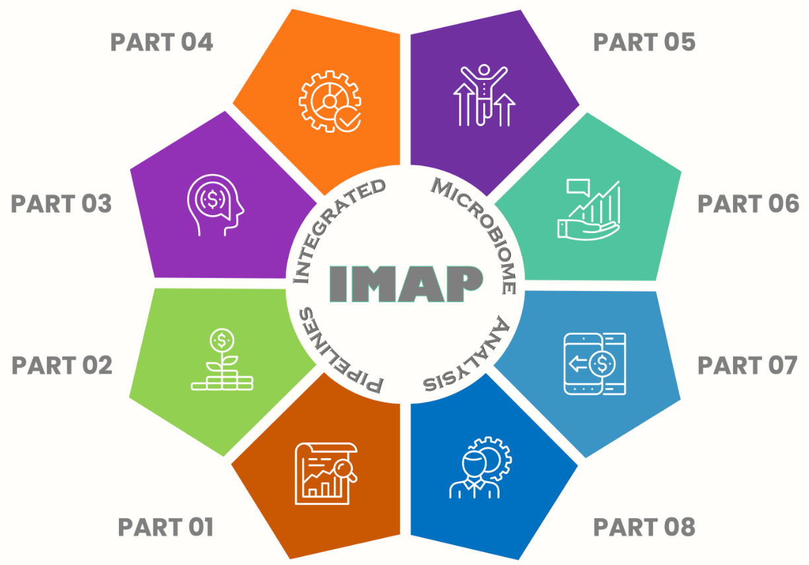

# (PART) IMAP PROJECT {-}

# About IMAP Project {-}

IMAP, primarily denoting **Integrated Microbiome Analysis Pipelines**, encompasses over eight standalone GitHub repositories.' 

 
 

 
 

This project provides a systematic approach to microbiome data analysis, extending beyond conventional methods. It offers a detailed, step-by-step approach to understanding and executing systematic analyses of microbiome data. The content guides users through the application of bioinformatics tools, their functionalities, and the integration of bioinformatics pipelines. It also explores visualization techniques, specifically utilizing R and Python, in addition to Snakemake Workflows and GitHub Actions.

A central focus is placed on fostering reproducibility in microbiome data analysis, emphasizing best practices, standardized approaches, and robust tools to ensure the reliability and replicability of results. The guide instructs users on how to effectively document and share analysis pipelines, contributing to the advancement of the field.

The incorporation of practical examples, real-world datasets, and visualization techniques using R and Python equips readers to confidently analyze intricate microbiome datasets. The integration of Snakemake Workflows and GitHub Actions not only streamlines analyses but also enhances efficiency by automating repetitive tasks.

'Systematic Microbiome Data Analysis: End-to-End User Guides' serves as an exhaustive companion for researchers, scientists, and bioinformatics practitioners. It empowers readers to unravel the intricacies within microbiome data, leverage bioinformatics tools, implement reproducible workflows, and derive meaningful insights into the microbial world.

# Mission and Vision {-}

**Mission**: The project mission is to make microbiome data analysis accessible, user-friendly, and reproducible for researchers and practitioners alike. We aim to provide comprehensive resources and practical guidance to empower individuals in unlocking the secrets of the microbial world hidden within their data.

**Vision**: The project vision is to foster a community of reproducible and transparent microbiome data analysis, where researchers can confidently apply standardized methods and share their workflows, enabling collaboration and advancing scientific discoveries. We strive to *bridge the gap between bioinformatics and microbiome research*, equipping users with the tools and knowledge to navigate the complexities of data analysis in a robust and efficient manner.

<!-- # Acknowledgements {-} -->

<!-- I extend my sincere gratitude to my previous employers, Mississippi State University and Penn State University, for granting me the opportunity to serve as a computational molecular biologist and computational scientist, respectively, in the field of omics. My most recent project, supervised by Dr. Vivek Kapur at Penn State University, focused on bushmeat microbiome bioinformatics. During this endeavor, my responsibilities included the analysis of 16S rRNA gene sequencing data and the development of bioinformatics resources.  -->

<!-- I extend my sincere appreciation to Google, a steadfast companion throughout my professional journey, and more recently, to ChatGPT, which has played a vital role in assisting me as I seek additional insights, fine-tune ideas, and explore new possibilities along my career path. -->

<!-- I express my gratitude to my husband, Professor Joram Buza, for introducing me to the proteomics field at Mississippi State University. His initial insights played a pivotal role in sparking my passion for computational roles within omics fields. Although his direct contribution to my academic and professional journey may be limited, his initial belief in me was instrumental in fueling my dedication to the captivating realm of omics, which extended later into the domain of microbiome bioinformatics. -->

<!-- Lastly, I express profound gratitude to my children, Joe, Janeth, and Steve. The creation of extensive guides of this nature, without financial support, presented significant challenges. Their unwavering support and love have been indispensable throughout this intricate journey. I am eternally thankful for the encouragement and support system they have provided me. My love for them knows no bounds. -->

<!-- # Dedication {-} -->

<!-- To my incredible children, Joe, Janeth, and Steve, this series of practical user guides stands as a heartfelt tribute to the unwavering support and invaluable financial assistance you've provided during challenging moments. Celebrating Joe's academic accomplishments as a computer science major and software engineer, Janeth's dedication to finance and her role as a Risk Analyst, and Steve's pursuits as a computer science major and dedication as a Business Analyst, each of you brings unique strengths that have profoundly shaped our family journey. -->

<!-- Beyond your professional pursuits, I want to express my deepest gratitude to Janeth and KiAndre for being dedicated and loving parents to my grandson Elijah. Your commitment to both family and career is truly admirable. -->

<!-- As we anticipate creating more shared moments, achieving new milestones, and embracing the unknown together, my heart is filled with gratitude for your constant presence, understanding, and unwavering confidence in my endeavors. With heartfelt appreciation and immeasurable love, I remain your ever-devoted mother. -->

<!-- # (PART) AUTHOR'S PERSPECTIVE {-} -->

<!-- # Motivation and Commitment {-} -->

<!-- ## Author Accomplishments and Expertise -->

<!-- Teresia Mrema-Buza, Ph.D., stands as a distinguished computational molecular biologist and accomplished bioinformatics researcher. Her remarkable achievements are underscored by her commitment to advancing the field of data analysis through a multifaceted approach. -->

<!-- Specializing in offering practical user guides as open source contributions on GitHub, GitHub Pages, and her CDI website, Teresia has made significant strides in disseminating knowledge. These comprehensive guides span a diverse array of topics, including microbiome studies, bioinformatics, data science, and more. Tailored to cater to varying proficiency levels, from beginners to advanced users, each guide is meticulously designed to offer step-by-step workflows and invaluable insights for effective data analysis. -->

<!-- Teresia's illustrious career spans over a decade, marked by impactful roles in higher learning institutions. She served as a computational molecular biologist in omics fields at Mississippi State University and later as a computational scientist specializing in microbiome bioinformatics at PennState University. -->

<!-- At present, Teresia's primary objective is to provide reproducible and practical user guides, empowering researchers, scientists, and enthusiasts to seamlessly transform complex data into actionable insights and also to continue be a mentor in transforming complex data into actionable insights. -->

<!-- Her work is accessible to the public through [GitHub](https://github.com/), [GH-pages](https://pages.github.com/), or the [CDI website](https://complexdatainsights.com), reflecting her dedication to advancing microbiome research through open-access resources and fostering collaboration and knowledge sharing. For more information, you can visit [Complex Data Insights (CDI)](https://complexdatainsights.com) website to see more of her passion and commitments. -->

<!-- ## Author Motivation {-} -->

<!-- Following the conclusion of the bushmeat microbiome project at Penn State University in 2018, I made a personal commitment to continue contributing to the microbiome research community. This commitment led me to develop reproducible practical user guides that enable researchers to transform complex data into valuable biological insights. -->

<!-- Recognizing the considerable costs associated with data analysis in microbiome studies and the potential pitfalls of using incorrect approaches, I felt compelled to write this practical user guides. Motivated by the versatility of the `bookdown` package [@bookdown2021], which builds upon the R Markdown package [@rmarkdown2018], and drawing from my experience in a separate microbiome-related project [@TMBuza2019], I aimed to make a meaningful impact by providing reproducible solutions. -->

<!-- Through self-training and continuous learning, I've accumulated significant knowledge since my last publication. My passion lies in creating visually appealing HTML practical user guides that simplify complex data into actionable insights. This practical user guides are a culmination of that passion and the expertise I've gained along the way. -->

<!-- ## Ongoing Learning Journey {-} -->
<!-- With a shared goal of fostering reproducibility and impactful discoveries in microbiome research, I hope these guides become valuable resources. Together, aided by technological advancements and a collaborative community, we can navigate the challenges of microbiome data analysis, unlock new knowledge, and make significant contributions to this fascinating field. -->

<!-- While these guides don't claim to be exhaustive, is a way of encouraging readers to explore additional solutions. With a shared goal of fostering reproducibility and impactful discoveries in microbiome research, this resource aims to support researchers, students, developers, trainers, and enthusiasts in navigating challenges and contributing to this dynamic field. -->

<!-- ## Author Commitment {-} -->
<!-- In a dedicated effort to advance collaboration and understanding between bioinformaticians and biologists, this work seeks to bridge the gap impeding progress in microbiome research. Acknowledging the distinct objectives and linguistic disparities inherent in these two groups, the guide aspires to provide user-friendly and practical insights. -->

<!-- ### Bridging the Gap {-} -->
<!-- Bioinformaticians often prioritize quick outputs and require the right tools, while biologists seek to analyze data for biological insights, relying on their expertise and hypotheses. This dichotomy can impede collaboration and hinder progress. The commitment is to establish a common platform by offering comprehensive user guides accessible to both bioinformaticians and biologists. -->

<!-- ### Catalyst for Collaboration {-} -->
<!-- The guide aims to act as a catalyst for collaborative efforts in microbiome research. By providing accessible user guides, the objective is to serve as a shared space where both bioinformaticians and biologists can discover tools and techniques aligned with their specific goals. -->

<!-- The overarching aim is to break down communication barriers by harmonizing language and understanding. This endeavor strives to encourage effective communication, propel collaborative initiatives, and elevate microbiome research to new horizons. Importantly, the work is a dynamic commitment, with each chapter marked as "In-progress," offering readers a continuously improving and evolving resource. -->
